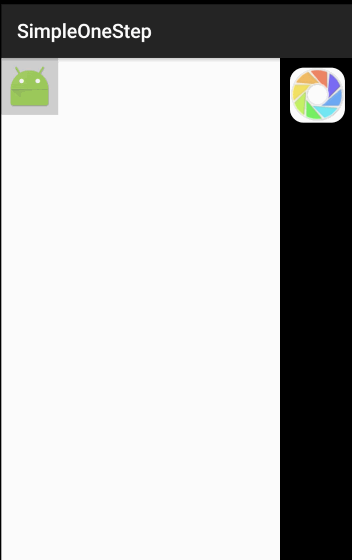
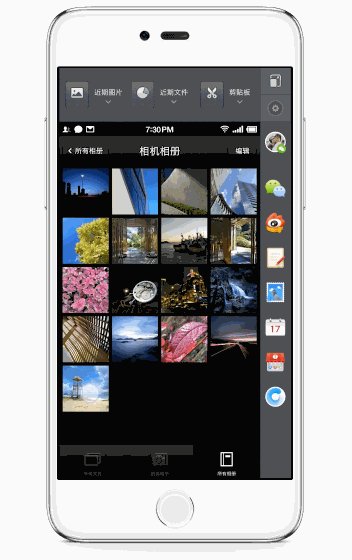

# SimpleOneStep

This is like ``OneStep`` about ``Smartisan OS 3``.

### Feature

* Drag & drop UX
* Share Image to wechat

### Screenshots

-------

### 功能

* 拖拽 & 放下 的交互
* 分享至微信朋友圈

### 小贴士

上图截取的锤子的``OneStep``中，图库多选实现方式可参见：[Android-AbsListView-Drag-And-Drop](https://github.com/gavinliu/Android-AbsListView-Drag-And-Drop）
